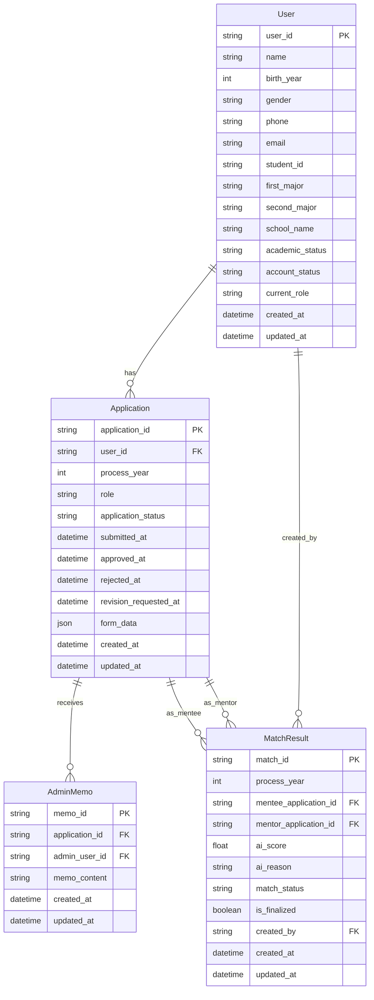

# pLAWcess Database Schema

## ERD

```mermaid
erDiagram
    User ||--o{ Application : "has"
    Application ||--o{ AdminMemo : "receives"
    Application ||--o{ MatchResult : "as_mentee"
    Application ||--o{ MatchResult : "as_mentor"
    User ||--o{ MatchResult : "created_by"

    User {
        string user_id PK
        string name
        int birth_year
        string gender
        string phone
        string email
        string student_id
        string first_major
        string second_major
        string school_name
        string academic_status
        string account_status
        string current_role
        datetime created_at
        datetime updated_at
    }

    Application {
        string application_id PK
        string user_id FK
        int process_year
        string role
        string application_status
        datetime submitted_at
        datetime approved_at
        datetime rejected_at
        datetime revision_requested_at
        json form_data
        datetime created_at
        datetime updated_at
    }

    MatchResult {
        string match_id PK
        int process_year
        string mentee_application_id FK
        string mentor_application_id FK
        float ai_score
        string ai_reason
        string match_status
        boolean is_finalized
        string created_by FK
        datetime created_at
        datetime updated_at
    }

    AdminMemo {
        string memo_id PK
        string application_id FK
        string admin_user_id FK
        string memo_content
        datetime created_at
        datetime updated_at
    }
```

## 제약조건

- `Application`: `UNIQUE(user_id, process_year, role)` — 같은 해 같은 역할 중복 신청 불가
- `MatchResult`: `approved` 상태 Application만 매칭 대상
